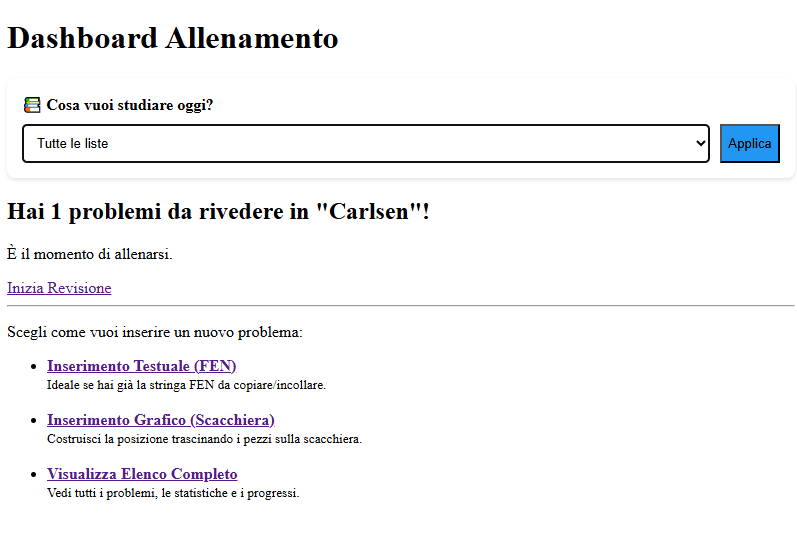
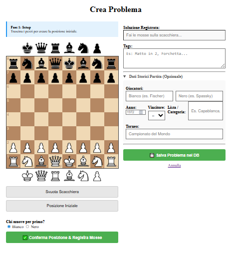

# ♟️ Chess Tutor: Spaced Repetition Training


**Chess Tutor** is a full-stack web application designed to help chess players memorize tactics and key positions efficiently. 

Unlike standard puzzle solvers, this app implements the **SuperMemo-2 (SM-2) Spaced Repetition Algorithm**. This ensures that users review positions right before they are likely to forget them, optimizing the learning process.

## ✨ Key Features

* **🧠 Spaced Repetition Engine:** Custom implementation of the SM-2 algorithm to schedule reviews based on user performance (Easy, Medium, Hard, Wrong).
* **🎨 Interactive Board Editor:** Drag & drop interface built with `chessboard.js` to set up positions and record solution moves visually.
* **📂 Smart Organization:** Organize puzzles into custom lists (e.g., "Capablanca Games", "Rook Endgames") for focused study.
* **📜 Historical Metadata:** Support for tracking game context: player names (White/Black), year, tournament, and match result.
* **🔐 Secure Authentication:** User login system protected by Two-Factor Authentication (2FA) via Email using Flask-Mail.
* **📱 Responsive Design:** Optimized for both desktop and mobile usage.

## 🛠️ Tech Stack

* **Backend:** Python (Flask), SQLite
* **Frontend:** HTML5, CSS3, JavaScript (jQuery)
* **Libraries:** * `Chess.js` (Game logic & validation)
    * `Chessboard.js` (UI Visualization)
    * `Flask-Login` & `Flask-Mail` (Auth & Security)

## 🚀 Installation & Setup

1.  **Clone the repository**
    ```bash
    git clone [https://github.com/TUO_USERNAME/chess-tutor.git](https://github.com/TUO_USERNAME/chess-tutor.git)
    cd chess-tutor
    ```

2.  **Create a Virtual Environment**
    ```bash
    python -m venv venv
    # Windows
    venv\Scripts\activate
    # Mac/Linux
    source venv/bin/activate
    ```

3.  **Install Dependencies**
    ```bash
    pip install -r requirements.txt
    ```

4.  **Configure Environment Variables**
    Create a `.env` file in the root directory and add your credentials (needed for 2FA):
    ```env
    SECRET_KEY=your_secret_random_key
    MAIL_USERNAME=your_email@gmail.com
    MAIL_PASSWORD=your_app_password
    RECEIVER_EMAIL=your_email@gmail.com
    ```

5.  **Initialize Database & Run**
    ```bash
    python app.py
    ```
    The application will be available at `http://127.0.0.1:5000`.

## 📸 Screenshots

| Dashboard | Editor Grafico |
|:---:|:---:|
|  |  |

## 🔮 Future Improvements

* Multi-user support with registration.
* Import/Export PGN files directly.
* Statistics dashboard (progress charts).

## 📄 License

This project is open source and available under the [MIT License](LICENSE).
